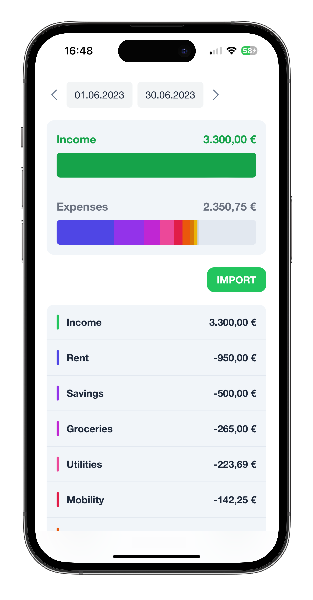
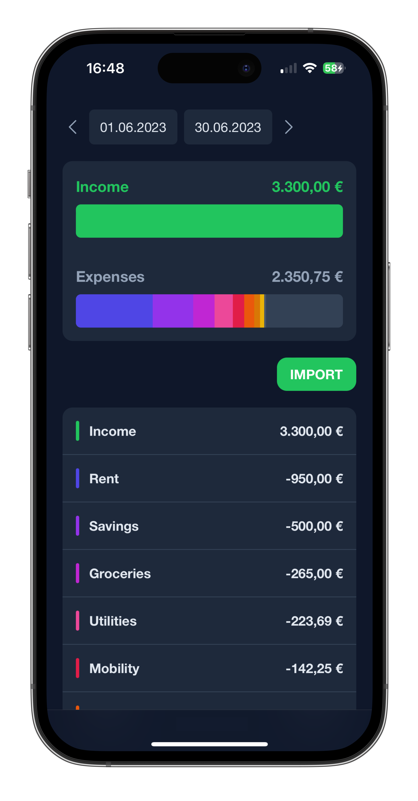
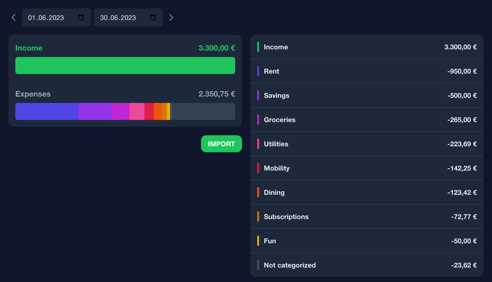

# bookkeeper


Bookkeeper is an application set of an Angular WebApp and simple API written in Go to manage your
income and expenses of a month. You define some categories with RegEx rules to automatically
match your transactions and upload your bank statement as CSV file. The backend will then
automatically assign the categories to the transactions.

## Features

### API

- Import your bank statement as CSV file (see supported banks below)
- Define categories in your PostgreSQL database
- Create matching rules with RegEx for your categories
- Completely hosted by **yourself**, nothing leaves your system

### Supported banks

- ING

### WebApp

- View your transactions in a nice dashboard
- Beautiful in light and dark mode
- Developed for a mobile first experience

#### Mobile




#### Desktop



## Installation

### Prerequisites

- [Docker](https://docs.docker.com/get-docker/)

The recommended way to run bookkeeper is a containerized setup using Docker. As we need a running
PostgreSQL instance as a datastore for the API, it is recommended to use a docker-compose setup.

### API Environment Variables

#### `DB_HOST`

The hostname of the PostgreSQL instance.

#### `DB_NAME`

The name of the database to use.

#### `DB_USER`

The username to use for the database connection.

#### `DB_PASSWORD`

The password to use for the database connection.

### Docker Compose Setup

The following `docker-compose.yaml` file will setup a minimal bookkeeper instance, with a PostgreSQL instance,
Traefik as a reverse proxy and the API and WebApp containers. You'll need to create a `web` network using
`docker network create web`.

```yaml
services:

  traefik:
    image: traefik:v2.10
    restart: always
    ports:
      - 80:80
      - 443:443
    volumes:
      - /var/run/docker.sock:/var/run/docker.sock
    expose:
      - "8080"
    networks:
      web:
        aliases:
          - traefik

  postgres:
    image: postgres:14
    environment:
      - POSTGRES_DB=bookkeeper
      - POSTGRES_USER=bookkeeper
      - POSTGRES_PASSWORD=s3cr3t
    restart: always
    networks:
      web:
        aliases: 
          - postgres

  backend:
    image: ghcr.io/docqube/bookkeeper/api:latest
    labels:
      - traefik.enable=true
      - "traefik.http.routers.backend.rule=Host(`bookkeeper.example.com`) && PathPrefix(`/api`)"
      - traefik.http.services.backend.loadbalancer.server.port=8080
    environment:
      - DB_HOST=postgres
      - DB_NAME=bookkeeper
      - DB_USER=bookeeper
      - DB_PASSWORD=s3cr3t
    expose:
      - "8080"
    restart: always
    depends_on:
      - postgres
    networks:
      web:
        aliases: 
          - backend
  
  frontend:
    image: ghcr.io/docqube/bookkeeper/frontend:latest
    labels:
      - traefik.enable=true
      - traefik.http.routers.frontend.rule=Host(`bookkeeper.example.com`)
    expose:
      - "80"
    restart: always
    depends_on:
      - backend
    networks:
      web:
        aliases: 
          - frontend

networks:
  web:
    external: true
```
